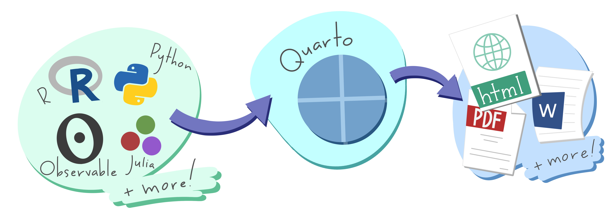
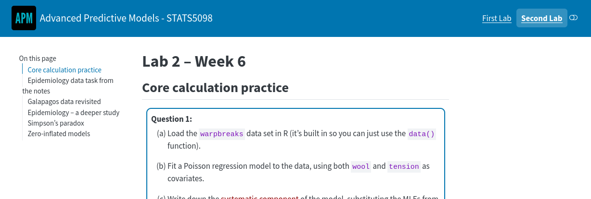
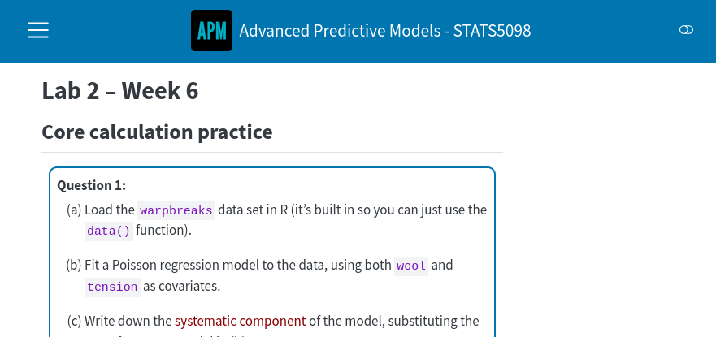
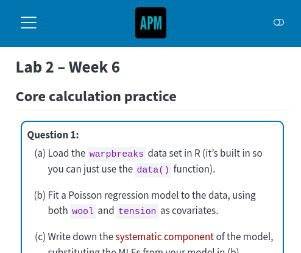

## What is Quarto?

Quarto is an open-source publishing system. You'll be writing your content in Quarto's Markdown language, a highly readable [markdown]{.alert} format

Using markdown will mean your content is easily transformed into many different outputs both now and in the future

Markdown is not a TeX, Powerpoint or Word file. It's closest to TeX, in spirit -- it's text-based, but has less syntax

:::{.callout-warning}

## Disclaimer

I don't work for RStudio/Posit, but have just been working with their ecosystem since at least 2016 as it works for me. So, I'd say an experienced practitioner
:::

## Origins and modern day

Born from R, RStudio and the RMarkdown environment, but **no longer just for R**. Nowadays with native support for [Python]{.alert}, [Julia]{.alert} and [ObservableJS]{.alert} (not that you need to know what they are)

The desire was for a system capable of creating outputs which contain code and the result of running it

The modern standalone `quarto` software means it can be used by people writing their resources in other environments (though RStudio & Positron offer nice visual interfaces)

:::{.notes}
Mention reproducibility
:::

## a Quarto schematic

{fig-alt="Illustration showing that you can write one file including R, Python, Observable or Julial; feed it into quarto; and expect html, pdf and others as outputs"}

## Documentation

The Quarto website <<https://www.quarto.org>> is generally excellent for documentation and well-maintained. Many features are identical to former RMarkdown, but some have been improved and streamlined

Extensive gallery of sample creations at <<https://quarto.org/docs/gallery/>>

Plus many excellent blogs, and personal sites with advice and recommendations

Especially check out work by Mine Çetinkaya-Rundel

## Software interface choices

* Nowadays Posit make RStudio and Positron (based on VSCode)
* Quarto available as standalone software so
  * can run from command-line with any text-editors
    + just run `quarto render <filename>`
  * or via plug-ins inside VSCode, JupyterLab and others
  
I believe most people use RStudio (inertia), Positron or JupyterLab

These three offer built-in clickable buttons to 'Build your output'

## Output targets

For accessibility what we really want is a machine-readable output. Here are the common Quarto output formats, which do we want?

+ HTML? Definitely

+ PDF? Maybe

+ Word/docx? Maybe

+ revealjs? Yes, HTML for presentations

+ epub, pptx, and others? Unlikely

[Pandoc]{.alert} is the real transformation software running behind Quarto to convert your source materials into these many outputs.

**However** not all output formats will be nice accessible things.

## The rendering schema

{fig-alt="Illustrating to show that qmd files are run through knitr or jupyter; to convert to an md file; then pandoc converts that md into HTML, or PDF or Word or more"}

## Resource types

+ Single page (e.g. worksheet)
+ Multipage/Website (e.g. book, lecture notes)
+ Separate mini-books (e.g lecture chapters)
+ Lecture/Presentation slides (e.g. like these)

In our academic world many of these were historically PDF (thanks to LaTeX), or Word/Powerpoint (availability). In the last ten years, we now have easy access to HTML.

In Quarto-world there are many standard project templates: **book**, **website**, and **presentation** (i.e. slides), manuscripts and blog (but there are more!).

:::{.notes}
this is why I called quarto a publishing system like TeX
:::

## What is accessible?

I'm primarily talking about easily machine-readable HTML

So that **any browser can display it** and a **user can customize** if they wish

More generally, so that any external accessibility-focussed software can easily navigate and permit a student to explore whatever they desire in **whatever way they wish or need**

You've come to today's workshop so you don't need me going into detail what sorts of features and what needs or desires people may have -- but I will tell you a little of how Quarto accommodates some of them

  e.g. responsiveness, landmarks/heading/structure, further colour customization, navigability, use of language

## Getting started

1. Install R (optional)

2. Install Python (optional)

3. Install an IDE (integrated development environment)
    + RStudio and Positron contain Quarto
    + JupyterLab you'll want the Quarto extension
    + Or just install Quarto separately
    
## Examples, examples, examples

For getting started... the default plain templates/projects aren't very informative

I recommend you start with a template of someone else's work to see what's possible

Some of my current favourites include Tom Coleman's (St Andrews) examples from his recent Scottish Maths Support Network workshop <<https://github.com/tdhc153/smsn-quarto-workshop>>

Here is the workshop itself <<https://tdhc153.github.io/smsn-quarto-workshop/>>

Not many sample templates I've found specifically address accessibility. You may also like [Uni of Glasgow staff template](https://UofGStats.github.io/booktemplate/index.html).

## Accessibility concerns

+ Lots of customization options
  + easy to become in-accessible
+ Not all features are super accessibility friendly out-of-the-box
  + a few defaults are poor (currently)
+ Occasional browser dependency issues
  + fancier features may need checking

:::{.notes}
Users may go wild with colours
Users aren't forced to follow good practices, like alt-text
PDF no issues, but poor. HTML browser checking worth doing
:::

## The good

+ Images (`fig-alt`)
+ Structure (`#`, `##`, `###`, ...)
+ Videos (`<video>` or `<iframe>`)
+ [Plug-ins](https://quarto.org/docs/extensions/) (like a11y for slides)
  - quarto add mcanouil/quarto-revealjs-a11y@0.1.1 then `A`
+ Responsiveness
+ MathJax
+ Code formatting (mostly)
+ Browser plug-ins

## The more difficult

+ Dual HTML/PDF output (Quarto uses LaTeX)
  + **not universal feature overlap** e.g. video, animations
  + colour naming
  + layout control
  + LaTeX macros
+ **Dissemination/hosting of HTML**
  + Anything but a simple HTML document is multiple files

## Target is HTML with MathJax (or MathML) {visibility="hidden"}

+ Alt text for images, figures and diagrams
+ Structure for screenreaders
+ Customizable display with browser-based accessibility software
+ "Responsive" (screen-size adaptability)
+ Want same quality of output as from LaTeX

# My tips {.invert}

I can't promise the "best" advice, but hopefully it's very good

## Tips for dual output, HTML plus PDF (via LaTeX)

This forces certain writing approaches for displaying elements, e.g.
    
+ tables (`grid` tables)
+ images (`title`, `caption`, `label`, `alt-text`)

For example, when adding images only an R-chunk approach allows caption and alt text to be distinct (may change in future Quarto updates)

Colouring of text needs care too, in-built colours are not the same in HTML/CSS and LaTeX. 

LaTeX knowledge is needed, to debug errors

## Plug-ins and shortcodes

Just like new LaTeX packages may provide new functionality, you can seek out Quarto extensions (or even make them yourself) to add new functionality

Some of the good accessibility functionality will no doubt make its way into the core in future versions of Quarto without need to add them yourself

Examples of extensions include:

+ revealjs a11y (press ),
+ numbered-boxes (see [demo chapter 4](https://uofgstats.github.io/booktemplate/Ch4.html#custom-numbered-blocks)),
+ [shortcodes](https://quarto.org/docs/authoring/shortcodes.html#built-in-shortcodes), 
+ simple iframes (see demos: [Numbas embed](https://uofgstats.github.io/booktemplate/Ch5.html#numbas-embedding), [nicer YouTube](https://github.com/david-hodge/iframe/#new-youtube-feature))

## MathJax versions

Newer versions of MathJax are not always pointed to by default. 

### Sample equation

$$f(a) = \frac{1}{2\pi i} \oint\frac{f(z)}{z-a}dz$$

Code like this (in your qmd file header)

::: {.instruction title="MathJax loading code"}
```
html-math-method:
  method: mathjax
  url: "https://cdn.jsdelivr.net/npm/mathjax@4/tex-mml-chtml.js"
```
:::

enforces the loading of the new MathJax 4.1.2 (at time of writing).

## Videos

With the in-built shortcode syntax you an embed videos from elsewhere which already contain captions etc...

```{.markdown shortcodes="false"}





```
Remote hosting and using existing accessibility features elsewhere is cleanest

## Demo Quarto Markdown Source 

::::: {.columns}

::: {.column width="50%"}

### The markdown code

```{.vlightblue code-line-numbers="false"} 

+ Hello
+ Me

### Level 3 heading

Here is a small equation: $x^2+y^2=z^2.$
  
Or maybe a big equation,

$$
\int_{0}^{\infty}e^{-x^2}\,\textrm{d}x
$$ {#eq-abc}

$$
x^2+y^2 \tag{\dagger}
\label{eq:abc}
$$

That previous equation is manually tagged as \eqref{eq:abc}.

For automatic numbering in Quarto you must use \$\$ notation. This was equation @eq-abc.
```
:::

::: {.column width="50%"}

### The output

:::{.boxed .small}
+ Hello
+ Me

### Level 3 heading

Here is a small equation: $x^2+y^2=z^2.$
  
Or maybe a big equation,

$$
\int_{0}^{\infty}e^{-x^2}\,\textrm{d}x
$$ {#eq-abc}

\begin{equation}
x^2+y^2 \tag{\dagger}
\label{eq:abc}
\end{equation} 

That previous equation is manually tagged as \eqref{eq:abc}.

For automatic numbering in Quarto you must use \$\$ notation. This was equation @eq-abc.

:::

:::

:::::

## Responsiveness

::: {.panel-tabset}

## Wide

{fig-alt="Image of a website with a rich navigation bar due to a narrower"}

## Medium

{fig-alt="Image of a website with a reduced information navigation bar on full width"}

## Narrow

{fig-alt="Image of a website with minimal navigation bar, due to narrow width"}

:::

## Navigation

Navigating a Quarto-generated HTML with the keyboard can be a mixed bag

Not all in-built features behave perfectly, but they are improving

Tabbing generally works fine, in terms of reading order, all MathJax equations gain focus. 
The popular [panel tabset]{.alert} could/will be improved, indeed it's better already than when I last spoke about it

[See my R/Python switcher](https://uofgstats.github.io/booktemplate/Ch2.html#tabset-1-1)

## Callouts {transition="none"}

:::{.callout-tip}
Hopefully I can still do coloured boxes
:::

If so, then I can also customize them like this:

:::{.callout-warning}

# Watch Out!

There's danger ahead.

:::

Built-in callouts use strong contrasting colours in light mode. In dark mode they can *need* a black background.

## Let's do R {transition="none"}

```{r}
#| output-location: fragment
#| echo: true
#| fig-height: 3
#| fig-align: center

library(ggplot2)

mtcars |> 
  ggplot(aes(x = disp, y = mpg)) +
  geom_point() +
  geom_smooth(method = "loess",
    formula = "y~x")
```

## Let's do R

```{r}
#| output-location: fragment
#| echo: true
#| fig-height: 3
#| fig-align: center
#| fig-alt: "This is my description of the graph"

#| fig-alt: "This is my description of the graph"
library(ggplot2)

mtcars |> 
  ggplot(aes(x = disp, y = mpg)) +
  geom_point() +
  geom_smooth(method = "loess",
    formula = "y~x")
```

## Browser plug-ins

In Firefox, for example,

+ WAVE (accessibility checker)
+ Alt Text Viewer / AltVision

<hr>

+ HeadingsMap
+ Stylebot
+ Color Changer

:::{.callout-warning}

## Disclaimer

I'm not endorsing any of these!

:::

## Have a play this afternoon!

:::{.columns}


:::{.column width="45%"}
{width="100%" fig-alt="Photo of the Stelvio Pass, courtesy of paprycjusz on Instagram" }
:::

:::{.column width="50%"}
This ends my little tour

[Courtesy of paprycjusz on Instagram]{style="font-size:0.75rem;color:#666"}
:::
:::

